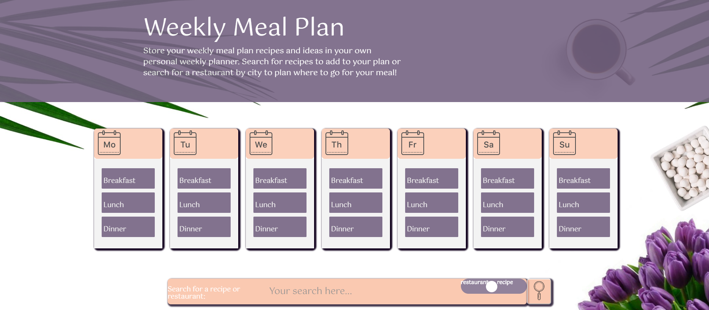
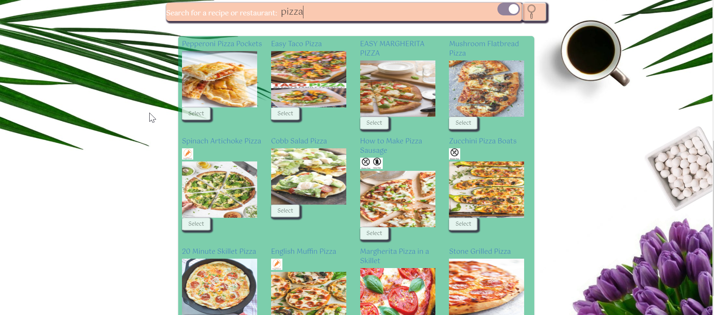
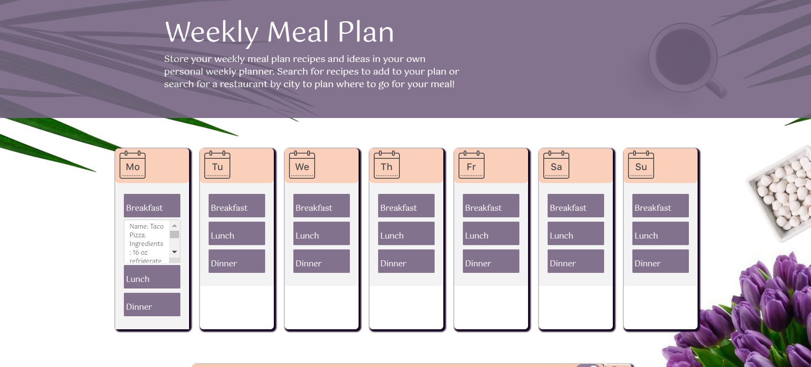
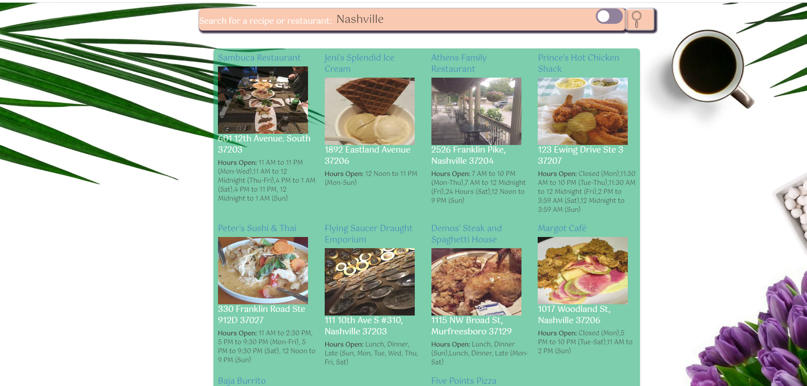

# Weekly Meal Planner

\*\*A browser-based app that allows the user to save searched recipes to a weekly meal planner

---

## Product features

-The **Homepage** features a Sunday through Saturday planner with open form style so that you can save the links you find for your favorite recipes and enter notes as desired. There is also a search bar located at the bottom of the page.

- Using the **Search bar** and **Toggle** selected to the right (highlighted in blue), the user can enter a keyword, and the browser will display a collection of relevant recipes from the most popular recipe sources on the web.

- The user can check out _ingredients list_ of each recipe.Once the  user finds a recipe they like, they are able to select which meal they would like to allocate it to.

- If the user would like to replace a home cooked meal with a dine out option, they can simply use the **Search Bar** and **Toggle** selected to the left and type in the city/state, and a list of the most popular restaurants in that area will populate.

-

---

## Technologies used

- [Spoonacular API](https://api.spoonacular.com/recipes/) _returns recipes from popular recipes sources on the web_

- [Zomato API](https://developers.zomato.com/api) _returns restaurants in the area_
- [Bootstrap](https://getbootstrap.com/) _framework_
- [Favicon Generator](https://www.favicon-generator.org/)_created favicon from local image_

- [Animate CSS](https://daneden.github.io/animate.css/)_animates search bar_

---

---

## Authors

- [Brooke Guarienti](https://github.com/brookeguarienti/)
- [Kortnie Heidel](https://github.com/KEHeidel/)
- [Melanie Warwick](https://github.com/melanoke4/)
- [Chinedu Moses](https://github.com/chinedu2moses/)
- [Chelsey Masood](https://github.com/devgirl221/)

***This group project is part of the Full-Stack Web Development program at Vanderbilt University based out of Nashville, TN.***
